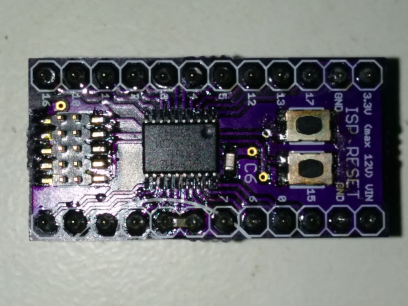
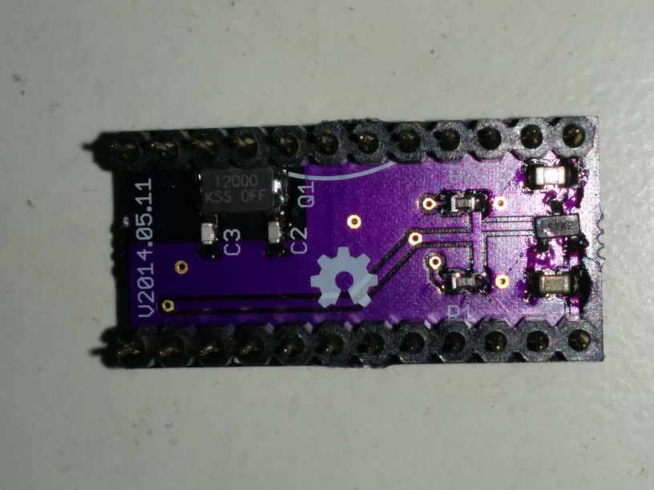
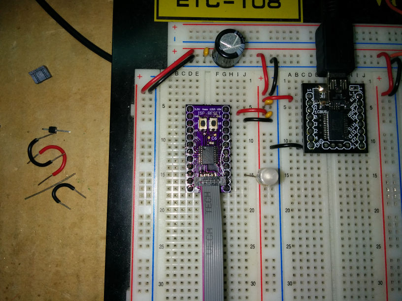
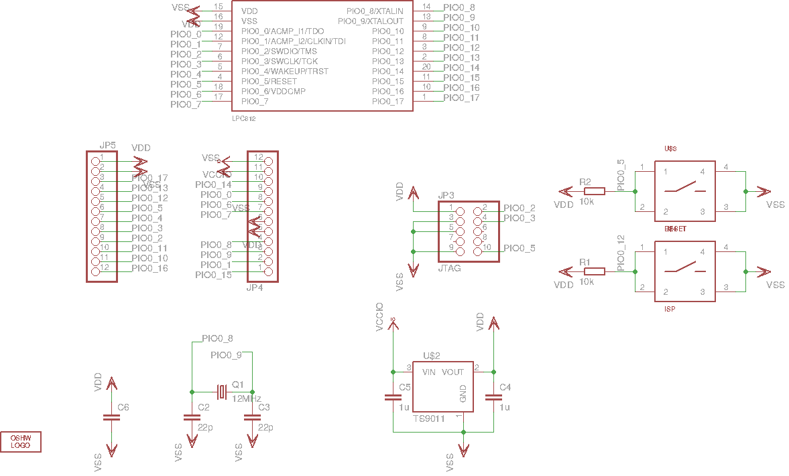

LPC812-breakout-JTAG
====================

Breakout board for the LPC812 TTSOP20 chip with on board regulator, crystal pads, reset/bootload buttons and 10 pin JTAG.

There are plenty of LPC812 breakout boards, why another one? Well this one has a JTAG (SWD) connector for debugging, 20 pins TTSOP mapping 1 on 1. Next to that it has the prerequisite 2 buttons for reset and enter bootload mode, this is more to recover from incorrect PLL settings then using the bootloader mode but if its always nice to have a fallback.
It has a footprint for TS9011SCXRF regulator and a 12MHz crystal. The TS9011SCXRF is pin compatible with the MCP1703 regulator. The crystal can be useful if you need a higher accuracy clock.

You can order PCB's [here at OSH Park](https://oshpark.com/shared_projects/b25GTusd) per three for $3.80 including shipping.

This project has been inspired by [another LPC812 breakout](https://github.com/cpldcpu/LPC812breakout) but did not have the features I wanted.

Useful information
==================

For nice Linux based build environments look at the [lpc8xx](https://github.com/sebseb7/lpc8xx) project by sebseb7.
I am working on combining the lpc8xx project makefile together with this [pretty comprehensive multi build target Makefile](https://gist.github.com/je-so/5614757) to create a build environment with debugging with code::blocks.

Status
======

 - 2014/04/18 V1.0 boards ordered at OSHpark
 - 2014/05/10 V1.0 boards received and assembled
 - 2014/05/11 V2014.05.11 boards ordered at OSHpark
 - 2014/06/01 V2014.05.11 boards received and assembled
 - 2014/10/09 V2014.09.10 boards (mini and with the regulator) ordered at OSHpark

Pictures
========

## Top ##

## Bottom ##

## In action on breadboard ##

## Schematic ##

