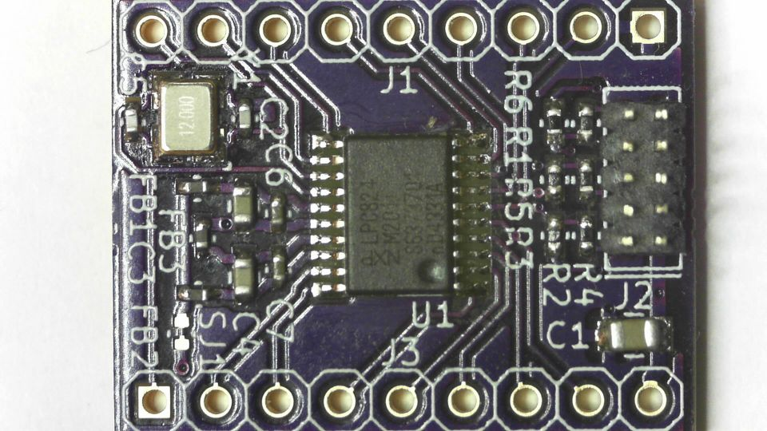

# LPC824 TSSOP20 breakout
This is a LPC824 breakout for the TSSOP20 package, all GPIO's are brought out and contains SWD programming header, crystal footprint and a decoupling network (capacitors and ferrite beads) for the analog supplies.

This breakout can be used in prototyping PCB and breadboards as the breakout headers have a 2.54mm pitch.
## TODO's
Still some things need to be done:
* schematic entry (Done)
* PCB layout (Done)
* Review with one night in between (Done)
* Produce at [OSHPARK](https://oshpark.com/shared_projects/RIWbBn4d)
* Assemble (Done)
* Full test program (Done)
* Upload some pictures and expand description
## BOM
Due to the general shortage of passive components, where mentioned, just whatever you can find.
* 0402 100nF 6.3V (generic)
* 0402 Ferrite bead (Murata BLM15PX601SN1D 600Ohm 900mA [Farnell](https://uk.farnell.com/2840091)
* 0402 100Ohm resistors for series dampening of programming lines
* 0402 100KOhm resistors for pullup on Reset, SWDIO and pulldown on SWDCLK
* 0603 1uF 6.3V (generic)
* LPC824 microcontroller [Farnell](https://uk.farnell.com/2448376)
* 12MHz crystal (optional) [Farnell](https://uk.farnell.com/2853917)
* The header I usually get from this vendor on [Ebay](https://www.ebay.com/usr/yixue2010), bit slow shipping and not the cheapest but the parts are good, he has a pretty sizable selection of connectors. 
## Photos

