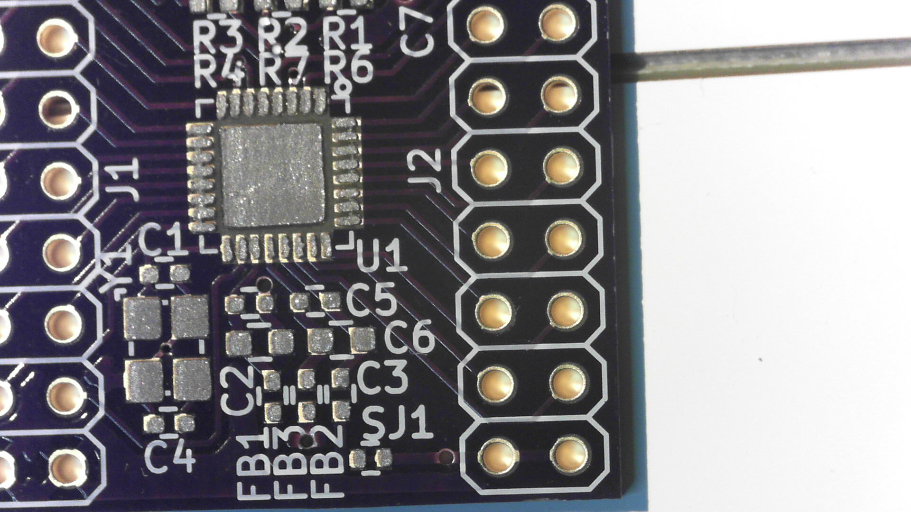
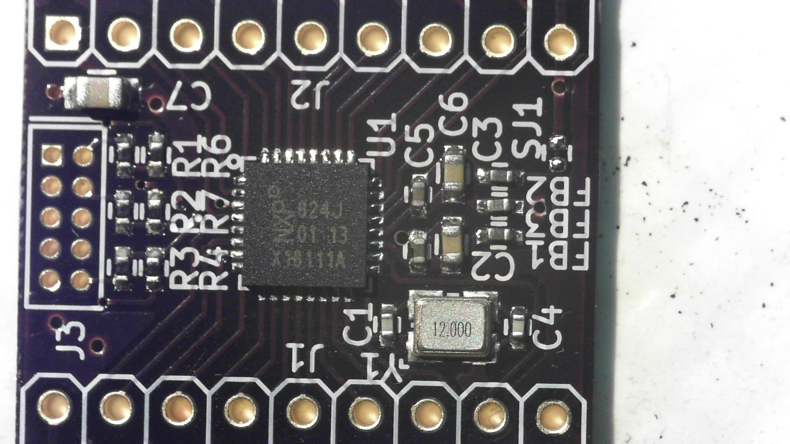

# LPC824 QFN33 breakout 2 layer version
This is a LPC824 breakout for the QFN33 package, all GPIO's are brought out and contains SWD programming header, crystal footprint and a decoupling network (capacitors and ferrite beads) for the analog supplies.

This breakout can be used in prototyping PCB as the breakout headers match the 2.54mm pitch of such a PCB.
## TODO's
Still some things need to be done:
* layout (Done)
* Review after a day (Done)
* Produce [OSHpark](https://oshpark.com/shared_projects/RuvO87MR) (Done)
* Assemble (Done)
* Full test program (Done)
* Upload some pictures and expand description (Done)
## BOM
Due to the general shortage of passive components, where mentioned, just whatever you can find.
* 0402 100nF 6.3V (generic)
* 0402 Ferrite bead (Murata BLM15PX601SN1D 600Ohm 900mA [Farnell](https://uk.farnell.com/2840091)
* 0402 100Ohm resistors for series dampening of programming lines
* 0402 100KOhm resistors for pullup on Reset, SWDIO and pulldown on SWDCLK
* 0603 1uF 6.3V (generic)
* LPC824 microcontroller [Farnell](https://uk.farnell.com/2448376)
* 12MHz crystal (optional) [Farnell](https://uk.farnell.com/2853917)
* The header I usually get from this vendor on [Ebay](https://www.ebay.com/usr/yixue2010), bit slow shipping and not the cheapest but the parts are good, he has a pretty sizable selection of connectors. 
## Pictures
This is one of the first PCB's that I assembled with a stencil, leadfree solder and then using a [ZB2020JR temperature controlled hotplate](https://www.aliexpress.com/item/Factory-new-listing-constant-heating-platform-for-smt-assembly-line-model-ZB2020JR/32962615046.html) to solder everything.

TODO, pictures of V20181124 on a bed of nails testing jig.
