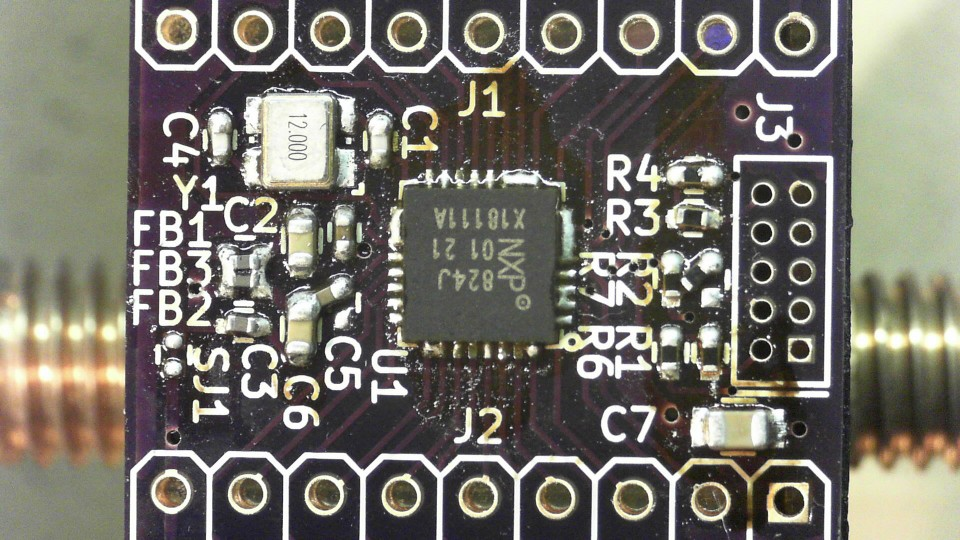

# LPC824 QFN33 breakout 2 layer version
This is a LPC824 breakout for the QFN33 package, all GPIO's are brought out and contains SWD programming header, crystal footprint and a decoupling network (capacitors and ferrite beads) for the analog supplies.

This breakout can be used in prototyping PCB as the breakout headers match the 2.54mm pitch of such a PCB.
## TODO's
Still some things need to be done:
* layout (Done)
* Review after a day (Done)
* Produce [OSHpark](https://oshpark.com/shared_projects/i9AZPwPX) (WIP)
* Assemble (redo)
* Test (blinky!)
* update Readme.md with pictures and BOM
## BOM
TBD/TODO: Most parts ordered from farnell.com
## Pictures
Here is a picture of V20181102 that has a ton of solder bridging, next revision will also have a stencil for more proper assembly.

